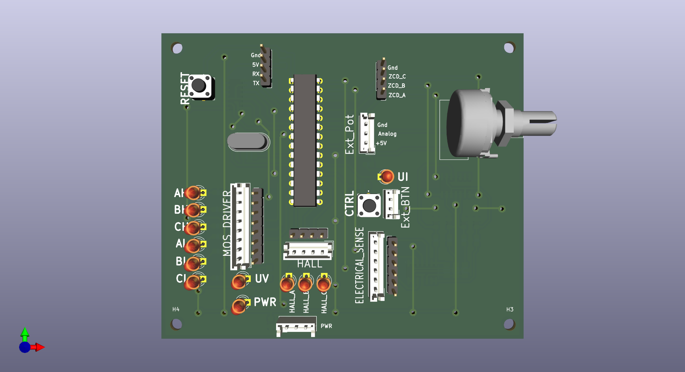
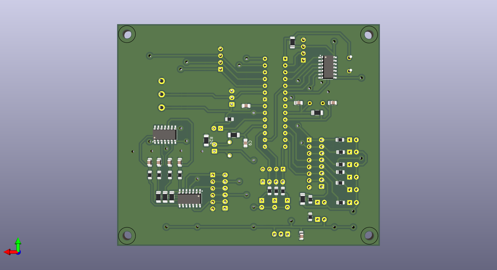
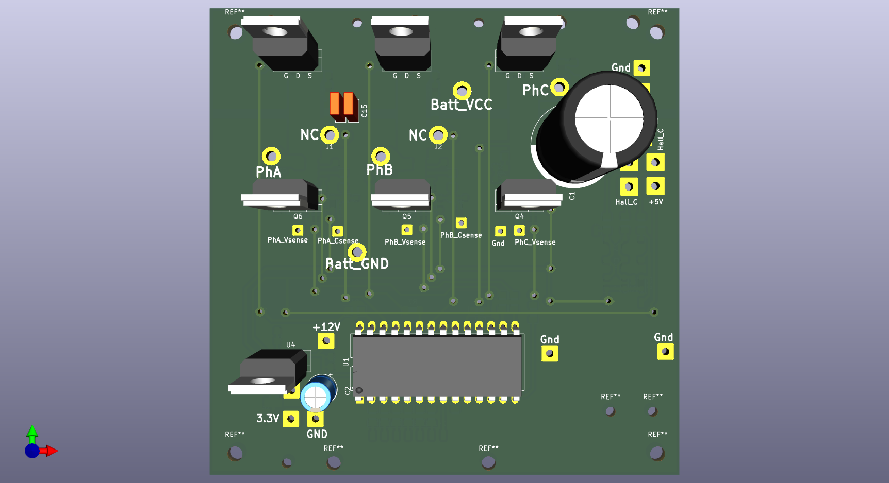
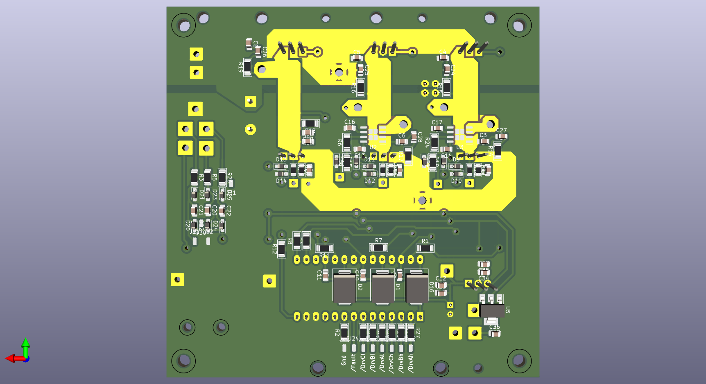
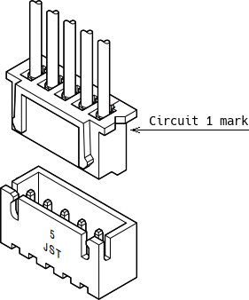
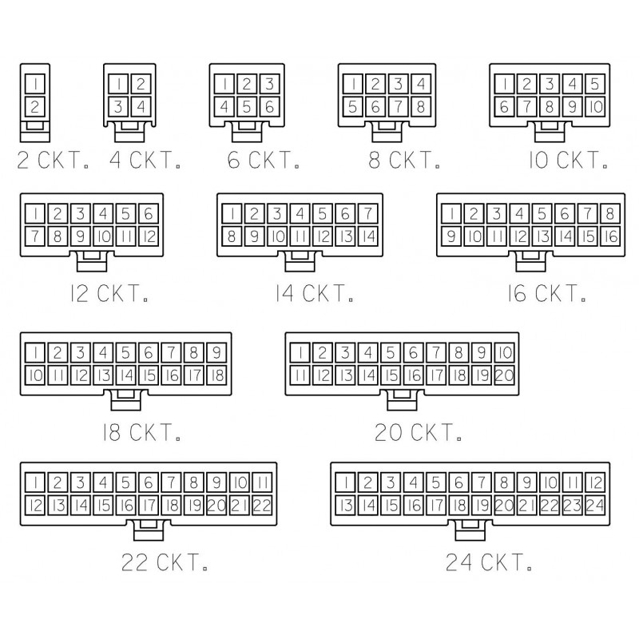
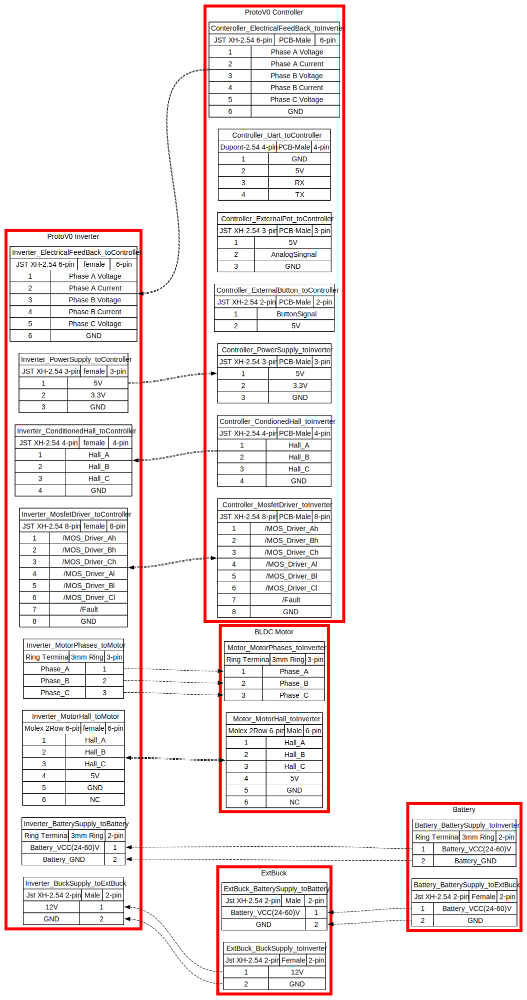

📁 `Controller`

# 🧠 BLDC Controller Board

---

## 🔁 Version & Overview

* **Version:** `v1.0`
* **Microcontroller:** `ATmega328P`
* **Designed using:** `KiCad`

The controller board enables BLDC motor control using ATmega328P and supports BEMF zero-crossing sensorless operation.

---

## 🔧 Features

* Sensorless BLDC drive (BEMF zero crossing)
* UART debugging
* Modular firmware architecture
* Supports 3.3V and 5V I/O
* Optimized for low-cost, compact embedded motor controllers
* Single-layer board with minimal top jumpers

#### Notes 
Remove onBoard Potentiometer if going to install external Potentiometer

---

## 🖼️ Hardware Preview

---

## 📁 Documentation

| Type            | Path            |
| --------------- | --------------- |
| 🧩 3D Model     | `./Controller/Docs/*.step` |
| 📝 Schematic    | `./Controller/Docs/*.pdf`  |
| 📂 Design Files | `./Controller`            |

### 🌐 Embedded 3D Viewer (STEP)

Try with: [https://3dviewer.net/](https://3dviewer.net/)
Upload: [`./Controller/Docs/*.step`](./Docs)

---

📁 `Inverter`

# ⚡ BLDC Inverter Board

---

## 🔁 Version & Overview

* **Version:** `v1.0`
* **Designed using:** `KiCad`
* **Power Rating:** `2KW+`
* **MOSFET Driver:** `IR2130`

---

## 🔧 Features

### ✅ Phase Voltage Feedback

* Each phase is conditioned via:

  $V_{cond} = V_{phase-ground} \times \left(\frac{2.2k}{49.2k}\right)$

* Filtered with **80kHz low-pass**

* Calibrate as needed due to resistor tolerances

### ✅ Line Current Feedback (ACS712-30A)

* For Phase A & B:

  $V_{cond} = \left( I_{line} \times 66\text{mV} + 2.5 \right) \times \left(\frac{5.1k}{15.1k}\right)$

* Filtered with **80kHz low-pass**

* Calibrate as needed due to resistor tolerances

### ✅ &#x20;General Specs

* 3.3V signal compatible
* Switching frequency up to **20kHz**
* Driver with built-in **dead time** (IR2130)
* 🌡️ **Thermal Management**: Adequate spacing for heat sinks
* Single-layer board with minimal top jumpers

---

## 🖼️ Hardware Preview

---

## 📁 Documentation

| Type            | Path            |
| --------------- | --------------- |
| 🧩 3D Model     | `./Inverter/Docs/*.step` |
| 📝 Schematic    | `./Inverter/Docs/*.pdf`  |
| 📂 Design Files | `./Inverter`            |

### 🌐 Embedded 3D Viewer (STEP)

Try with: [https://3dviewer.net/](https://3dviewer.net/)
Upload: [`Docs/*.step`](./Docs)

---

## 🔌 Connector Layout & Wiring
Proper connector pin labeling is essential for integration with other subsystems (sensors, MCU, battery, etc.). Images and pinout illustrations will help ensure correct assembly.

### 📷 Visual Reference
 #### 📍 Connector Numbering Reference
<!-- Replace with your actual images -->
**JST**

**Molex**

🔌 Sample Harness:  

---

## 📜 License

This project is licensed under the **MIT License**.
---

## 📬 Contact

Maintainer: **Omar Magdy**
📧 [omar.magdy.om.om@gmail.com](mailto:omar.magdy.om.om@gmail.com)

---
